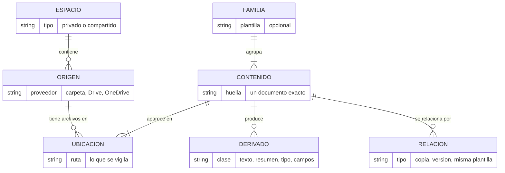
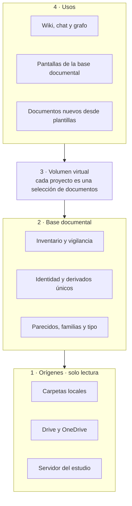
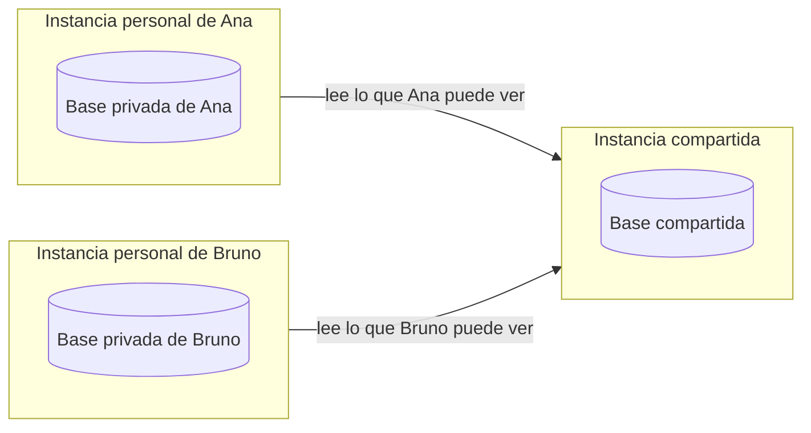
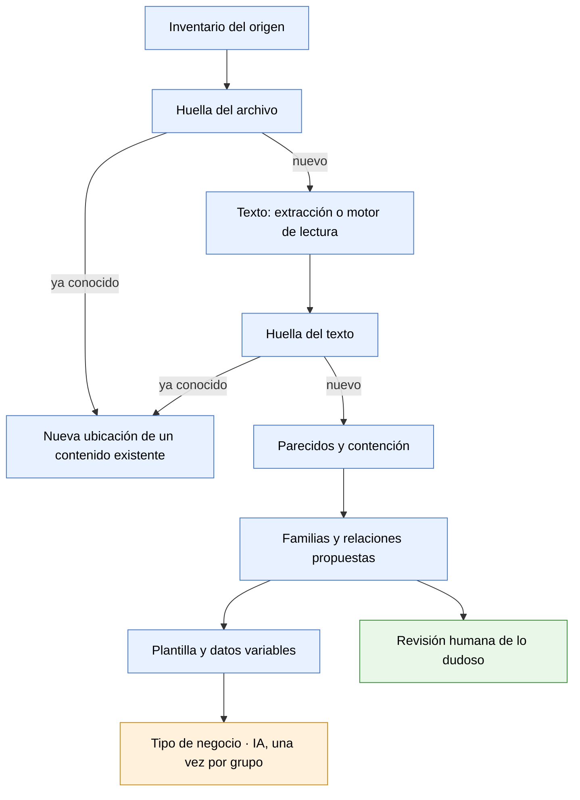
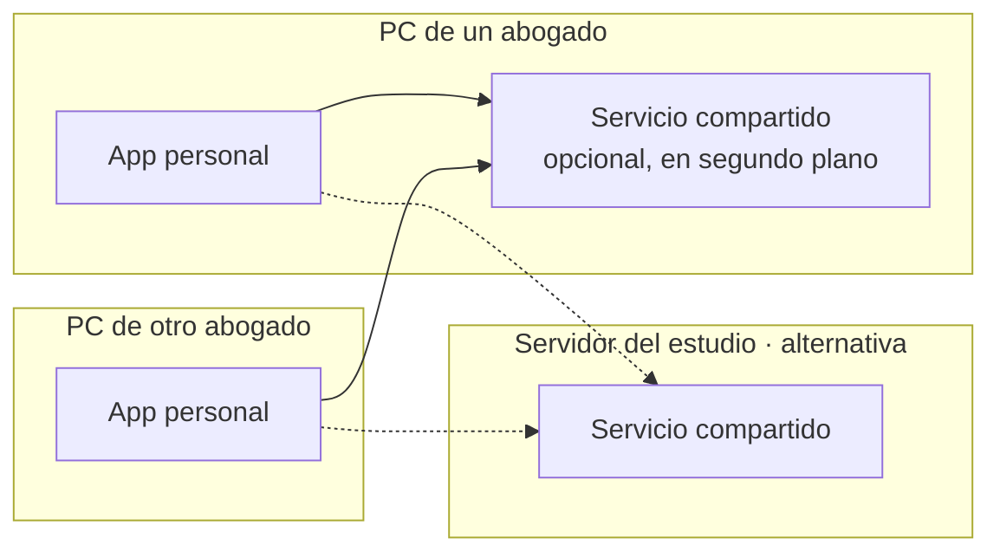
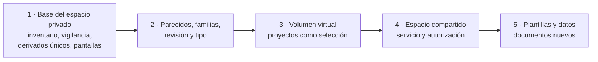

# Base documental — documento de diseño

**Estado:** dirección acordada, con decisiones abiertas (sección 9) · 9 de octubre de 2026
**Alcance:** qué vamos a construir y en qué orden. No describe código.

## 1. Propósito

Micelya Desktop deja de ser "una app de wiki con manejo de fuentes" y pasa a tener como cimiento una **base documental**: un componente que sabe qué archivos existen, dónde está cada copia, cuáles son el mismo documento, cuáles están emparentados y de qué tipo son, y que los vigila. El wiki, el chat y el grafo se montan encima.

Es una aplicación de uso personal que además puede trabajar con un espacio compartido y con otras instancias.

## 2. Principios

1. **Centrado en el archivo.** Todas las apariciones de un documento y sus variantes están identificadas y vigiladas.
2. **Los originales no se tocan.** No se alteran, mueven ni copian. Solo se guarda el resultado de procesarlos.
3. **Un solo derivado por documento.** Aunque haya muchas copias, su texto, resumen, huella y tipo existen una vez.
4. **Dos espacios.** Privado (de una persona) y compartido (de varias).
5. **Determinista primero.** La IA entra donde el cálculo no alcanza, y una vez por grupo, no por documento.
6. **El wiki ve un volumen virtual,** no el disco.
7. **Nuestras necesidades pesan más que la compatibilidad con upstream.**

## 3. Conceptos

Tres niveles que conviene no mezclar al decir "archivo":

- **Ubicación:** un archivo en una ruta. Es lo que aparece, cambia, se mueve o se borra.
- **Contenido:** un documento exacto. De él cuelgan los derivados.
- **Familia:** contenidos emparentados. De ella cuelgan las relaciones y, si existe, la plantilla.

## 4. Capas

La capa 3 le pregunta a la base solo tres cosas: qué fuentes hay, cuál es el texto de una, y qué cambió. Esa interfaz angosta es lo que permite que la capa de wiki siga pareciéndose a la original.

## 5. Espacios y visibilidad

- El espacio compartido **solo conoce lo compartido**. Nunca sabe qué hay en un espacio privado.
- Lo que ve una persona es **su espacio privado más lo que puede ver del compartido**.
- Hay **una base por espacio**. Los derivados son únicos dentro de cada una. Si un documento está en los dos, el cruce lo ve solo su dueño, desde su instancia personal.
- Un proyecto de wiki tiene **una sola visibilidad**. Uno privado puede usar documentos compartidos; uno compartido no puede usar privados.
- La visibilidad de un origen se indica al incorporarlo.

### Autorización

"Compartido" no significa "todos ven todo": un estudio separa asuntos por secreto profesional y conflicto de intereses. El esquema se piensa desde el principio al estilo de **UMA 2.0**, aunque no se implemente desde el momento cero:

- Cada recurso (origen, documento, derivado, página de wiki, resultado de búsqueda) tiene un **dueño**.
- El dueño fija **quién puede acceder y para qué**.
- Quien pide acceso obtiene un permiso de un **servicio de autorización**, separado de quien guarda el recurso.

Privado y compartido son los dos casos más simples de ese esquema: "solo el dueño" y "todos los del espacio". Lo que se construya primero tiene que dejar lugar para los intermedios (por asunto, por cliente del estudio, por persona) sin rehacer las capas.

## 6. Procesamiento

Azul: herramientas deterministas. Naranja: IA generativa. Verde: una persona.

- **Motores de lectura** (escaneos, fotos, audio): intercambiables. Candidatos: Codex, Amazon Textract, Amazon Transcribe. Leen y, cuando pueden, extraen campos. No clasifican.
- **Plantilla y datos:** en un comprobante la plantilla salta a la vista; en un contrato o un escrito hay mucho texto común y la plantilla es difusa. Se obtiene alineando los textos de una familia: lo que se repite es plantilla, lo que cambia son datos.
- **Versiones y ancestros:** el cálculo dice cuánto comparten dos documentos, no cuál vino primero. Se trata como un pipeline que suma señales (contención, fechas, nombres, metadatos del origen) y se mejora por iteraciones. El parecido nunca fusiona: propone.
- **Borrado:** cuando desaparecen todas las ubicaciones de un contenido, se borran sus derivados.

## 7. Despliegue

- La instancia compartida es un **servicio**, no necesariamente otra máquina: puede correr en la PC de un abogado o en un servidor.
- Hay **un solo escritor** por base compartida.
- Punto de partida: la app actual ya queda en segundo plano en la bandeja, puede arrancar con el sistema, y levanta dos servicios locales (uno de ellos una API protegida por clave) que se pueden abrir a la red local.
- **Cuenta de IA:** cada instancia usa la suya. La personal, la que elija la persona; la compartida, una propia. Los proveedores siguen siendo configurables, como hoy. El rango de usuarios va de un abogado solo a un estudio mediano.

## 8. Decisiones tomadas

| Tema | Decisión |
|---|---|
| Unidad de la base | El espacio, no el proyecto |
| Componente | Separado del fork; el fork es su primer cliente |
| Bases de datos | Dos: una del espacio personal y otra del compartido. No archivos JSON |
| Derivados | Únicos por espacio |
| Borrado | Sin ubicaciones, se borran los derivados |
| Drive y OneDrive | Por sus propias interfaces de cambios, no vigilando una unidad montada |
| Clasificación | IA, una vez por grupo |
| Proveedores de IA | Configurables por instancia |
| Autorización | Esquema al estilo de UMA 2.0, previsto desde el principio aunque se implemente después |
| Upstream | Se analiza cambio por cambio; no condiciona el diseño |

## 9. Decisiones abiertas

1. **Autorización: cómo se concreta.** Qué parte de UMA 2.0 se adopta (el protocolo completo o su modelo), cómo funciona en un servidor local del estudio sin administración o administrable a distancia, y cuánto se puede heredar de los permisos que ya tiene el origen (Drive, OneDrive). *Lo investiga el dueño del producto; este documento se actualiza con sus conclusiones.*
2. **La red.** Cómo se encuentran y colaboran las instancias: topología, y si hace falta un componente en la nube para sincronizar, mensajería y servicios comunes. Incluye ver cómo lo resuelven productos comparables, por ejemplo Obsidian. *Lo investiga el dueño del producto.*
3. **Motor de base de datos** y cómo lee una instancia personal la base compartida (propuesta: a través del servicio, nunca abriendo su archivo).
4. **Qué pasa con lo construido por proyecto** (catálogo, texto reconocido, detección de cambios): cómo migra a la base del espacio.

## 10. Etapas

Se empieza por el espacio privado y un solo usuario, que es lo que ya existe a medias. El espacio compartido multiplica cada decisión (permisos, concurrencia, servicio, cuenta de IA), así que llega cuando la base ya esté probada. Aun así, la etapa 1 ya registra el dueño de cada recurso, para que la autorización entre después sin rehacer nada.

## 11. Qué existe hoy

Dentro de `src-tauri/src/source_volume/`, todo por proyecto: montaje de carpetas, detección de cambios segura ante orígenes desconectados, catálogo de duplicados exactos, huella del archivo y texto reconocido guardado por huella (este último en el PR #17). Es la semilla del componente: los conceptos son los de este documento; cambia dónde viven los datos y a quién pertenecen.
